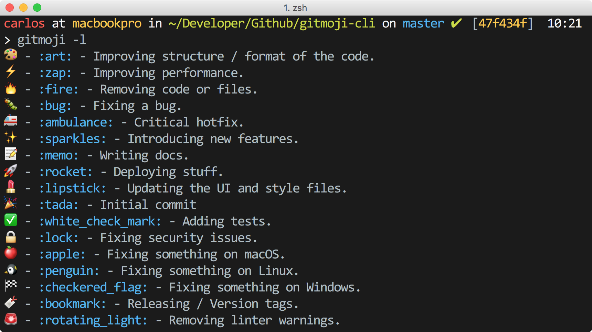

# git-handbook :zap:

[](http://shields.io/)
[]()

  


[官网主页](https://www.walle-web.io) | [文档手册](https://www.walle-web.io/docs) | [English Readme](https://github.com/meolu/walle-web/blob/master/README.md).

### git local repository 
___

- the fist change 001 
- test status
- git log


### git created juest local
___

- Here are a few basic commands for creatimg and viewimg files git code.


```

git mkdir filename           // craeded a new empty file
git cd filename              // enter filename
git ls -ah                   // show Invisible file
cat README.md                // show dile
```

- lets start to created a empty compository 

```
git init                     //Initialized empty Git repository in E:/w~~
git ls -ah                   // ./  ../  .git/

```

- create new file and submit 

```
ls                           // readme.md
git diff README.md           // diff file chaneg
git diff HEAD -- readme.txt

git add readme.md            
git commit -m "local fist commit"

```

- git log

```
git log --pretty=oneline      //show log
git  reset -- hard HEAD^^     //reset 
git reflog                    //show all code commitid
git reset --hard 265dsd~~     //reset
```


- check

```
git checkout -- file
git reset HEAD file
```

- dele file

```
rm test.txt
```


